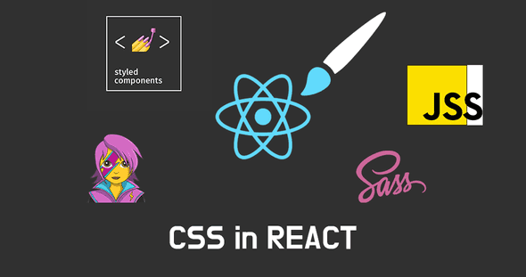

# styled-components란 ?

기존 DOM을 구성하는 방식인 CSS, SCSS 파일을 밖에 두고, 태그의 id나 class이름으로 스타일을 입히는 방식이 아닌
컴포넌트내에서 컴포넌트처럼 선언하여 스타일을 지정하는 방식(CSS-inJS)의 라이브러리.

### 외부 css파일을 통한 방식

```
title{
  font-size: 15px;
  color: white;
}
// .css
...
<h1 class="title>Hello World</h1>
//index.html
```

### styled-components 방식

```
import styled form "styled-components";

const Title = style.h1`
  font-size: 15px;
  color: white;
`;

<Title>Hello World</Title>
//Title.jsx
```

# styled-components 장/단점

## styled-components를 사용하는 이유(장점)

-   css모델을 문서 레벨이 아닌 컴포넌트 레벨로 추상화하는 모듈성.
-   짧은 길이의 유니크한 클래스를 자동으로 생성하는 코드 경량화.
-   CSS-in-JS 는 JavaScript 환경을 최대한 활용.

## styled-components 단점

-   CSS-in-CSS 에 비해 느린 속도.
-   별도의 라이브러리 설치에 따른 번들 크기 증대.
-   코드량 증가.

# styled-components 외에는 ?


Jss, Emotion, Aphrodite, Radium ,Styletron ...등 여러가지 라이브러리가 존재한다.

## Library 사용 트렌드


인기는 styled-component가 제일 높음!!!

# 나의 원픽 스타일링 라이브러리는 ??!!

정말 솔직하게 말한다면 아직까지 뭐가 좋은지 모른다.. 이론적으로만 좋은점을 알겠지 실제로 리액트로 개발을 하는 것이 이번이 처음이라 어떤것이 좋은것인지 모르겠다.
그런데 이번에 styled-componet를 사용해보면서 처음에는 어색했지만 사용하다보니 꽤 편리하게 적용할 수 있을거 같다는 생각이 들었다.
